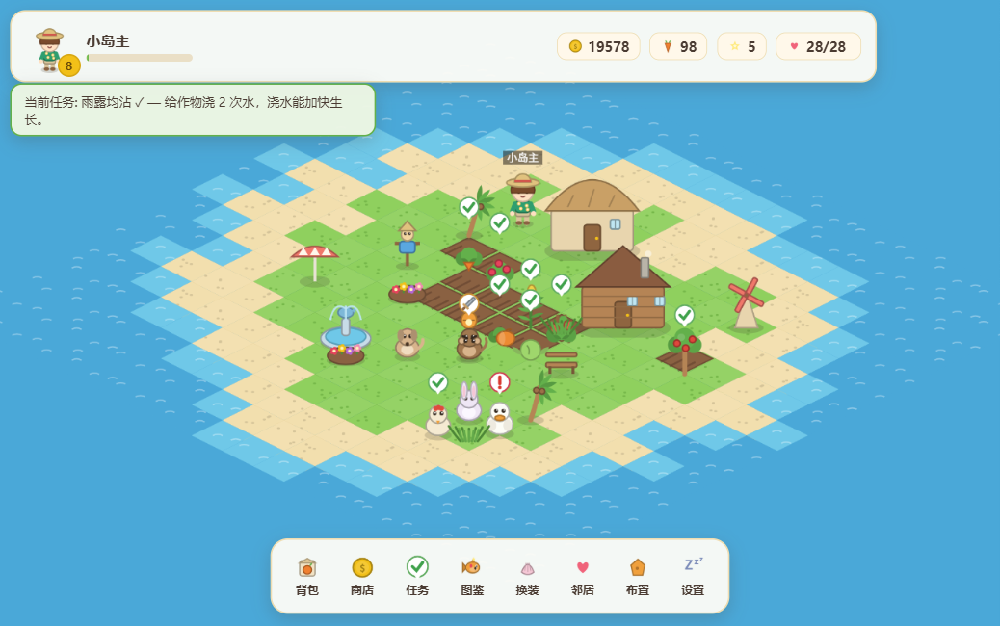
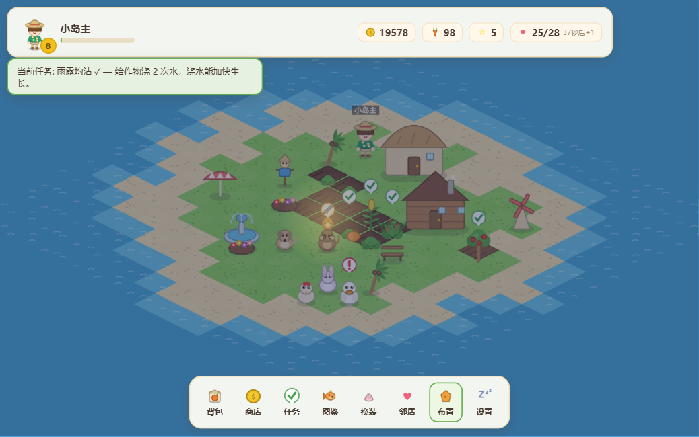
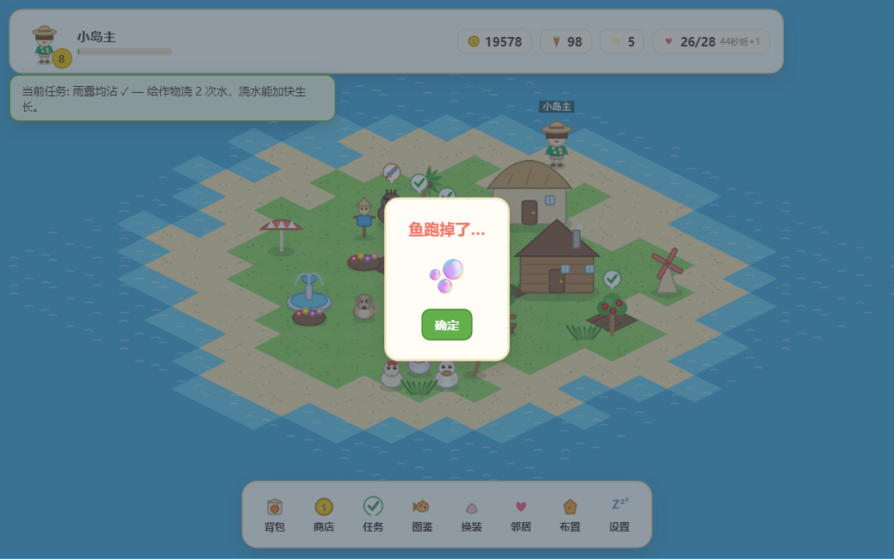
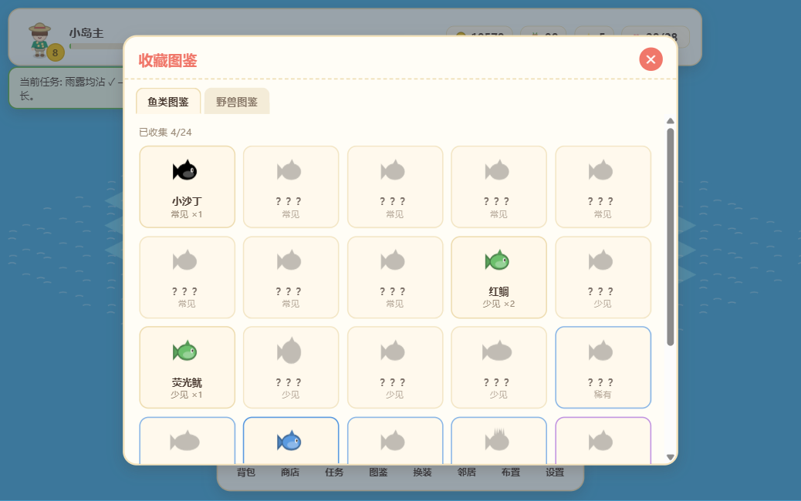
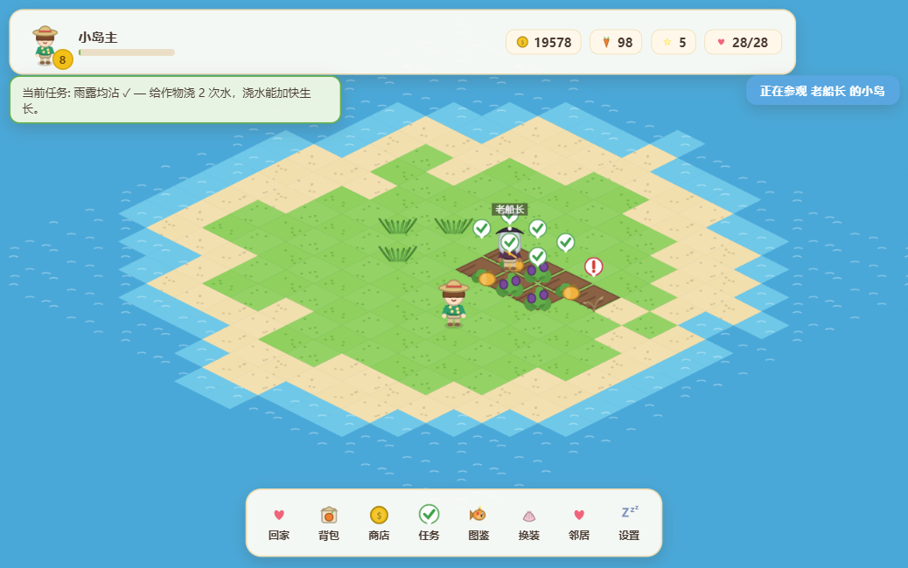

<div align="center">

# 🏝️ 天堂小岛 Paradise Isle

**一座装进浏览器的海上家园 —— 种田 · 钓鱼 · 斗兽 · 装扮 · 串门**

*An original open-source island life-sim for the browser, paying homage to the 2011 Tencent web game «QQ天堂岛».*

[](https://github.com/appleweiping/paradise-isle/actions/workflows/ci.yml)
[](LICENSE)


**[▶ 在线试玩 Play Online](https://appleweiping.github.io/paradise-isle/)**



</div>

---

## 目录

- [这是什么](#这是什么)
- [法律与致谢声明](#法律与致谢声明)
- [玩法系统一览（14 个系统）](#玩法系统一览)
- [截图画廊](#截图画廊)
- [快速开始](#快速开始)
- [操作说明](#操作说明)
- [技术架构](#技术架构)
- [内容规模](#内容规模)
- [存档与好友码](#存档与好友码)
- [可选：岛屿快照服务器](#可选岛屿快照服务器)
- [测试与 CI](#测试与-ci)
- [二次开发指南](#二次开发指南)
- [English Summary](#english-summary)

---

## 这是什么

《天堂小岛 Paradise Isle》是一款**完全运行在浏览器里的海岛生活模拟游戏**。你流落到一座无名小岛，从四块农田和一把胡萝卜种子开始，一步步把它经营成自己的天堂：

- 🌱 开垦农田，种下 **26 种作物与果树**，浇水加速、错过收获会枯萎
- 🐔 驯养 **10 种动物**，喂食后按周期产出鸡蛋、羊毛、松露……
- 🎣 在岸边甩竿，通过"咬钩 → 收线"小游戏捕捉 **24 种鱼**，集齐图鉴
- ⚔️ 击退定时入侵的 **8 种野兽**（从灌木野猪到雾中岛龙），守护庄稼
- 🏠 用 **42 种建筑装饰**自由布置小岛，美观度还能加成收获经验
- 👕 **44 件服装**换装系统：发型/肤色/表情/上装/下装/帽子/配饰，纸娃娃实时渲染
- 🐶 领养 **8 只宠物**，小狗自动驱兽、猫咪提升稀有鱼概率、小猪每天寻宝
- 🏡 拜访 **8 位性格各异的 NPC 邻居**：帮工赚声望、捣蛋也赚声望（但掉好友度）、花钱雇佣他们来自家岛干活
- 📮 **好友码**：把整座岛压缩成一串文字发给朋友，对方粘贴即可来你岛上参观——不需要任何服务器
- 🌙 真实时间驱动：作物离线也在生长，回来弹出离线摘要；白天黑夜随现实时钟流转，夜里路灯和篝火会亮

一切都在一个静态页面里完成——**没有后端、没有账号、没有素材文件**。所有图形（地形、作物、动物、建筑、角色、图标）都是启动时用 Canvas 程序化画出来的，音效和背景音乐由 WebAudio 现场合成。

## 法律与致谢声明

> **本项目是对 2011 年腾讯网页游戏《QQ天堂岛》玩法的致敬性原创重制（fan remake），与腾讯公司没有任何关联，亦未获得其授权或背书。**
>
> - **零原版素材**：本仓库不包含任何来自《QQ天堂岛》或腾讯的图片、音频、代码或数据；全部美术为运行时程序化绘制的原创图形，全部音频为 WebAudio 原创合成，全部文案为原创。
> - **玩法致敬**：游戏机制层面参考了公开媒体报道中对原作玩法的描述（岛屿建设、种植、驯养、斗兽、垂钓、换装、宠物、邻居互动、能量体系），游戏规则本身不受版权保护；具体数值、内容、美术、程序均为独立设计。
> - "QQ天堂岛"与"腾讯"是其各自权利人的商标，本文仅作事实性指称。
>
> 谨以此项目纪念那个网页游戏的黄金年代。 🕯️

## 玩法系统一览

| # | 系统 | 说明 |
|---|------|------|
| 1 | **岛屿世界** | 程序化生成的等距海岛（种子决定海岸线），5 档扩岛：18×18 → 34×34；真实时钟驱动昼夜，入夜后路灯/篝火/灯塔发光 |
| 2 | **种植** | 18 种田地作物：幼苗→生长→成熟→可收获→枯萎 五阶段实时演化；浇水一次减 25% 剩余时间（5 分钟冷却） |
| 3 | **果树** | 8 种果树不枯萎，首次成熟后按独立周期重复结果 |
| 4 | **畜牧** | 10 种动物：喂食（消耗食物资源）→ 等待产出周期 → 收取；饥饿/待收取有头顶气泡提示 |
| 5 | **野兽入侵** | 按等级动态刷新；点击进入战斗小游戏（摆动指针，绿区命中/中心暴击），落空会被反击踩坏作物；置之不理 4 小时后野兽自行离开并搞破坏；稀有兽掉珍稀材料 |
| 6 | **钓鱼** | 三段式小游戏：甩竿等待 → 700ms 咬钩窗口 → 连点收线保持指针在绿区；3 级鱼竿逐步解锁高稀有度鱼池；5 档稀有度 24 种鱼入图鉴 |
| 7 | **建设装饰** | 42 种建筑/装饰/自然造景/道路/功能建筑；布置模式支持摆放、移动、镜像翻转、半价收纳；道路可通行、贴地渲染 |
| 8 | **换装** | 7 个装扮槽位纸娃娃系统，44 件服装（从喜庆唐装到星闪泳装再到蓝色西装——向原作的衣柜致意）；HUD 头像与岛上角色实时同步 |
| 9 | **宠物** | 8 只宠物 4 种被动技能：驱兽 / 幸运钓鱼 / 能量恢复+10% / 每日寻宝；喂食玩耍积累宠物经验升级 |
| 10 | **资源体系** | 金币 / 食物 / 能量 / 声望 / 经验 五资源；能量每 90 秒回 1 点、上限随等级涨、升级瞬间回满 |
| 11 | **等级解锁** | 60 级成长曲线，作物/动物/建筑/服装/宠物/扩岛全部按等级渐进解锁 |
| 12 | **任务成就** | 16 步新手教程链逐个介绍系统；每日任务池 12 选 3（按天+种子确定性刷新）；20 个多阶梯成就 |
| 13 | **邻居社交** | 8 位 NPC 邻居各有人设、台词、偏好作物和一座**会随时间自主演化**的小岛（自己收获补种、长杂草）；帮工（浇水/除草/驱兽，声望+金币+好友度）、捣蛋（声望+但好友度-，次数限制）、雇佣（150 金币包全岛家务）；好友度升级邻居会送礼 |
| 14 | **存档** | 3 个本地存档槽自动保存；base64 导出/导入；版本化 schema 迁移链（v1→v2→v3）；离线进度结算与回归摘要 |

## 截图画廊

| | |
|---|---|
|  |  |
| *经营中的小岛（正午）* | *同一座岛的深夜——注意路灯光晕与夜色* |
|  |  |
| *七页商店：种子/果树/动物/建筑/服装/宠物/工具* | *梳妆台：纸娃娃实时预览* |
|  |  |
| *收线阶段：保持指针在绿区* | *24 种鱼、5 档稀有度的收集图鉴* |
|  |  |
| *在老船长的岛上串门帮工* | *标题界面与三个存档槽* |

## 快速开始

**在线玩**：直接打开 → <https://appleweiping.github.io/paradise-isle/>

**本地跑**：

```bash
git clone https://github.com/appleweiping/paradise-isle.git
cd paradise-isle
npm install
npm run dev        # http://localhost:5173
```

**其他命令**：

```bash
npm run build      # 类型检查 + 生产构建（输出 dist/）
npm test           # 74 个单元测试（Vitest）
npm run typecheck  # 仅 TypeScript 严格检查
npm run server     # 可选的岛屿快照交换服务（见下文）
```

要求：Node.js ≥ 20。无任何运行时依赖，devDependencies 只有 `typescript` / `vite` / `vitest` 三件套。

## 操作说明

| 操作 | 效果 |
|------|------|
| **左键点击** 地块/动物/野兽/水面 | 弹出上下文菜单（种植/浇水/收获/喂食/战斗/钓鱼……），角色会先走过去 |
| **拖拽** | 平移镜头 |
| **滚轮** | 缩放（0.45×–2.2×） |
| **Esc** | 关闭菜单/面板/取消摆放 |
| 底栏按钮 | 背包 · 商店 · 任务 · 图鉴 · 换装 · 邻居 · 布置 · 设置 |
| **布置模式** | 点击已有建筑可移动/翻转/收纳；商店购买建筑后进入摆放虚影模式 |

小贴士：升级会回满能量；出售物品攒声望；捣蛋是原作特色——干坏事也涨声望，但邻居会生气。

## 技术架构

```
src/
├─ core/      确定性模拟核心（纯 TS，无 DOM）：作物/畜牧/野兽/钓鱼/建设/
│             经济/宠物/任务/社交/离线结算 —— 全部时间显式传参，可在 Node 中完整测试
├─ data/      内容表（数据驱动）：26 作物、10 动物、8 野兽、24 鱼、42 建筑、
│             44 服装、8 宠物、8 邻居、16+12 任务、20 成就 —— 改表即改游戏
├─ render/    等距渲染器 + 程序化美术：所有精灵启动时用 Canvas 画进离屏缓存，
│             2× 超采样保证缩放清晰；昼夜色调、光晕、深度排序
├─ ui/        DOM 覆盖层界面：HUD、七大面板、上下文菜单、toast、对话框
├─ game/      编排层：主循环、输入、场景切换（自家岛/邻居岛/快照岛）、
│             钓鱼与战斗小游戏
├─ social/    好友码：岛屿快照 → LZW 压缩 → base64url（小负载自动回退原始编码）
├─ save/      localStorage 槽位 + 导入导出 + 版本迁移链
├─ audio/     WebAudio 合成音效 + 五声音阶程序化 BGM
└─ i18n/      中文/English 双语（设置里一键切换）
```

**设计要点**

- **core 与表现完全解耦**：每个玩法函数形如 `harvest(state, plotUid, now)`，返回 `{ok, events}`；`now` 显式传入使离线结算 = 正常游玩同一套代码。
- **事件管线**：动作产生领域事件（`harvest`/`fishCatch`/`prank`…）→ 统一流入任务/成就/统计引擎 → 派生 UI 反馈。加新玩法只需发事件，任务系统自动兼容。
- **惰性时间演化**：作物阶段、能量恢复、动物产出全部由时间戳纯函数推导，不存在"每秒 tick 全世界"的状态漂移；邻居岛也按同一机制在你拜访时才追赶时间。
- **程序化美术**：`render/paint/` 下约 2000 行绘制代码就是全部"美术资产"。统一调色板 + 共享笔刷（软阴影/圆身体/叶片/星形）保证 150+ 个精灵风格一致；改一个 `PAL` 常量即可整体换色调。
- **确定性随机**：世界种子决定海岸线与邻居岛；每日任务用 `hash(种子+日期)` 抽取——同一天刷新多少次都一样。

## 内容规模

| 内容 | 数量 | 内容 | 数量 |
|------|------|------|------|
| 田地作物 | 18 | 建筑装饰 | 42 |
| 果树 | 8 | 服装 | 44 |
| 动物 | 10 | 宠物 | 8 |
| 野兽 | 8 | NPC 邻居 | 8 |
| 鱼类 | 24 | 教程任务 | 16 |
| 材料/特殊物品 | 9 | 每日任务池 | 12 |
| 成就（多阶梯） | 20 | 等级上限 | 60 |

以上数字全部由单元测试 `tests/content.test.ts` 强制下限校验——内容表被削减会导致 CI 失败。

## 存档与好友码

- **自动保存**：每 30 秒 + 页面隐藏/关闭时写入 localStorage（3 个槽位）。
- **跨设备**：设置 → 导出存档（复制 base64 到剪贴板）→ 另一台设备导入。
- **版本迁移**：存档带 schema 版本号，加载时按迁移链逐级升级，旧档不丢。
- **好友码**：邻居面板 → "复制我的岛屿码"。码是 `PI1.`（LZW 压缩）或 `PI0.`（原始）前缀的 base64url 字符串，包含地形种子、农田、建筑、形象与宠物快照。朋友粘贴后即进入你的岛参观。快照是单向的——对方的操作不会写回你的存档。

## 可选：岛屿快照服务器

游戏 100% 离线可玩。如果你想用短 ID 代替长好友码分享，可以跑仓库自带的零依赖 Node 小服务：

```bash
npm run server                      # 默认 http://localhost:8787
curl -X POST localhost:8787/island -d '{"code":"PI1.xxxx"}'   # → {"id":"a1b2c3d4e5"}
curl localhost:8787/island/a1b2c3d4e5                          # → {"code":"PI1.xxxx"}
```

数据落盘在 `server/data/`，无数据库、无账号体系，仅做快照中转。

## 测试与 CI

- **74 个 Vitest 单元测试**覆盖：RNG 确定性、经验/能量曲线、作物全生命周期（含枯萎/果树重复采收/浇水冷却）、畜牧循环、野兽刷新与战斗、钓鱼概率表（鱼竿加成的统计验证）、任务链推进与每日确定性、成就阶梯、邻居生成确定性/帮工上限/捣蛋/雇佣、存档迁移与导入导出、好友码 roundtrip（含中文与压缩验证）、离线结算、内容表完整性与经济数值健康度。
- **端到端冒烟**：真实浏览器中走通 新档→教程→种植→浇水→收获→商店→畜牧→战斗→钓鱼→换装→摆放→邻居帮工/捣蛋→存档读档 全流程，全程零 console error。
- **GitHub Actions**：每次 push 跑 typecheck + 测试 + 构建，main 分支自动部署 GitHub Pages。

## 二次开发指南

内容是数据驱动的，改表即改游戏：

```ts
// src/data/crops.data.ts —— 加一种作物只需要一行
crop('blueberry', '蓝莓', 'Blueberry', 7, 90, 60, 11, 3, 35 * M, 90 * M, 2, 4),
```

- 新作物/鱼/野兽会自动获得程序化图标与精灵（`hashColor` 兜底配色，可在 `render/paint/` 的映射表里加专属造型）。
- 新任务：在 `quests.data.ts` 里声明事件步骤（如 `{type:'fishCatch', target:'rare', count:3}`），引擎自动跟踪。
- 调平衡：所有数值曲线集中在 `src/core/balance.ts`。
- 控制台调试钩子：游戏内 `window.__PI__` 暴露 `state()` / `tileToScreen(x,y)` 等；`window.__PI_HOUR__ = 20` 可固定时刻预览夜景。

欢迎 PR：新内容、新语言包、平衡性调整、无障碍改进。

## English Summary

**Paradise Isle** is an original, fully client-side island life-sim game inspired by (and paying homage to) the 2011 Tencent web game *QQ天堂岛*. It is **not affiliated with or endorsed by Tencent**; it contains zero original assets — every sprite is drawn procedurally on Canvas at runtime, and all audio is synthesized with WebAudio.

**Features**: procedurally generated isometric island with 5 expansion tiers and a real-clock day/night cycle · 26 crops & fruit trees with real-time growth, watering and withering · 10 livestock animals · 8 invading beasts with a timing-based battle minigame · 24-fish fishing minigame with 3 rod tiers and a collection dex · 42 buildings & decorations with free placement and a beauty score · 44-piece paper-doll wardrobe · 8 pets with passive skills · energy/coins/food/reputation/XP economy with 60 levels of unlocks · 16-step tutorial chain, deterministic daily quests and 20 tiered achievements · 8 NPC neighbors with self-evolving islands (help, prank, or hire them) · offline progress settlement · save slots with schema migration · **friend codes** that compress your whole island into a pasteable string (no server needed) · optional zero-dependency snapshot-sharing server · Chinese/English UI.

**Tech**: TypeScript (strict) + Vite + Canvas 2D, zero runtime dependencies. A deterministic simulation core (pure functions over explicit timestamps) is fully covered by 74 Vitest unit tests and completely decoupled from rendering. See [Quick Start](#快速开始) above: `npm install && npm run dev`.

**License**: MIT. Play it here → <https://appleweiping.github.io/paradise-isle/>

---

<div align="center">

*献给所有在 2011 年的浏览器里种过田、捣过蛋的岛主们。*

</div>
